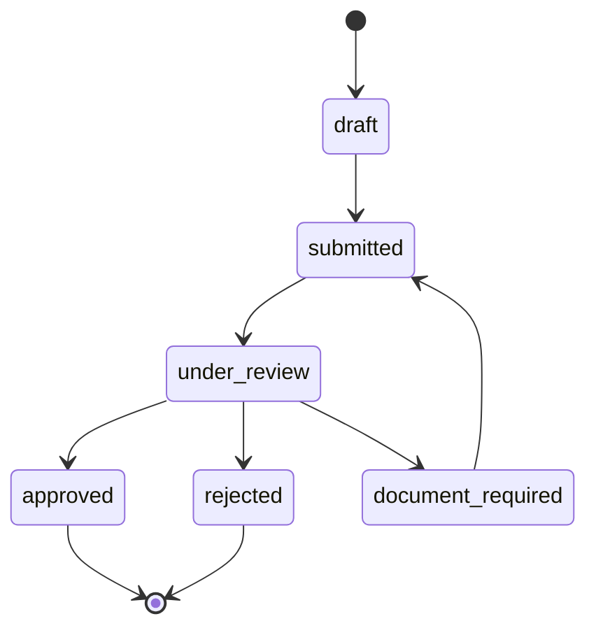

## Application State Machine Diagram

Luồng trạng thái theo yêu cầu:

`draft -> submitted -> under_review -> (approved -> end | rejected -> end | document_required -> submitted)`

```mermaid
stateDiagram-v2
    [*] --> draft

    draft --> submitted
    submitted --> under_review

    under_review --> approved
    approved --> [*]

    under_review --> rejected
    rejected --> [*]

    under_review --> document_required
    document_required --> submitted
```

